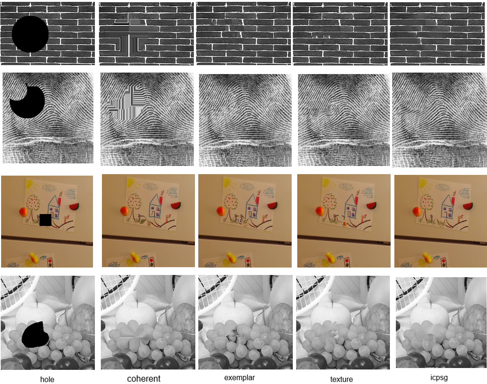

# hwOFImageInpaint
This is a code repository of my homework, which is utilized to paint image.

## Method 

"Texture Synthesis by Non-parametric Sampling" by efros. See details in `TextureSynthesis`.
"Image Completion using Planar Structure Guidance" by Jia-Bin Huang. See details in `StructCompletion-python`

## Result
All the result are saved in `result`. If you want to replicate the result, ask me for appropriate setup of parameters.

## notice 
This repo is just for my homework, but you can ask me that how to use that.
